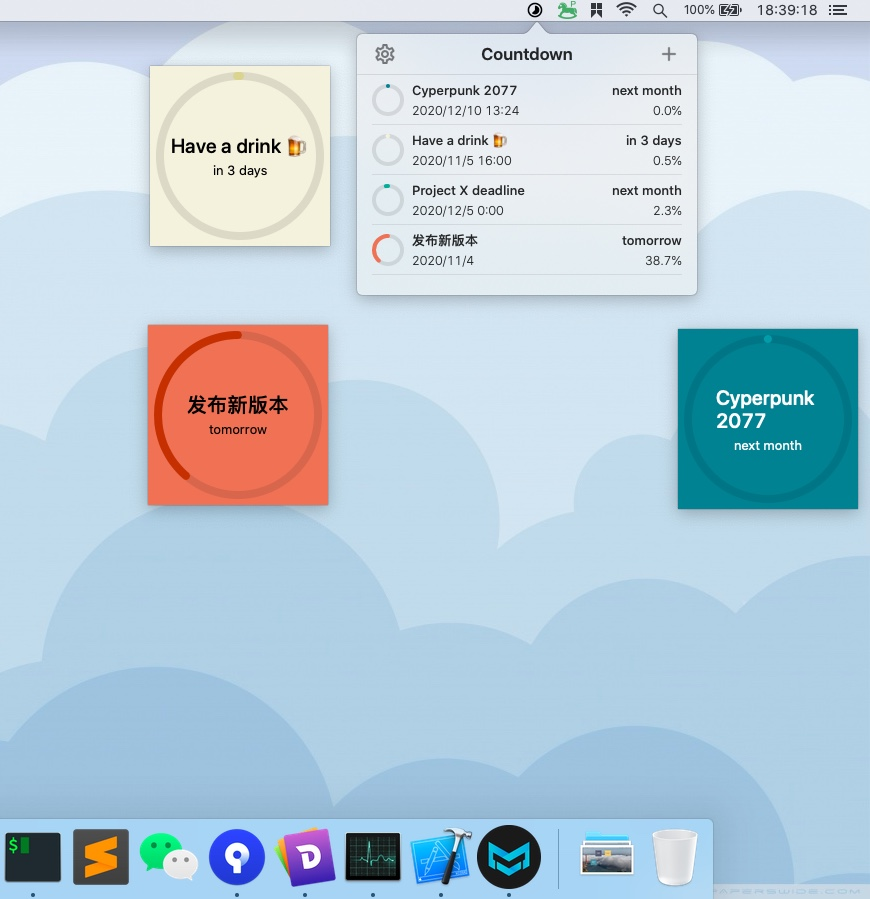

# Countdown

A countdown task App on macOS. You could manage your countdown task on macOS menubar, show sticky note on desktop.

It a imitation of the [Moment](https://fireball.studio/moment) and [‎Countdown Timer Plus](https://apps.apple.com/us/app/countdown-timer-plus/id1150771803?mt=12).

# Screenshot

# Installation

Visit the [releases page](https://github.com/funway/Countdown/releases) to download the latest version.

# Dev Environment

macOS 10.15.5

Xcode 11.7

# Libraries

Managed by Carthage.

- XCGLogger
  
  https://github.com/DaveWoodCom/XCGLogger

- SQLite.swift
  
  https://github.com/stephencelis/SQLite.swift

- DynamicColor
  
  https://github.com/yannickl/DynamicColor

- DateHelper
  
  version 4.4.1
  
  https://github.com/melvitax/DateHelper
  
  Just copy the DateHelper.swift file to Helper/ directory.

- HoverAwareView
  
  version 1.1.1
  
  https://github.com/aerobounce/HoverAwareView
  
  Just copy the HoverAwareView.swift file to Hepler/ directory.
